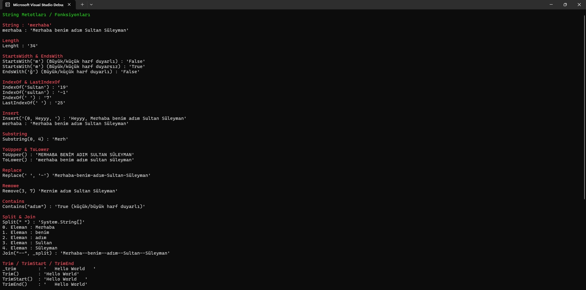
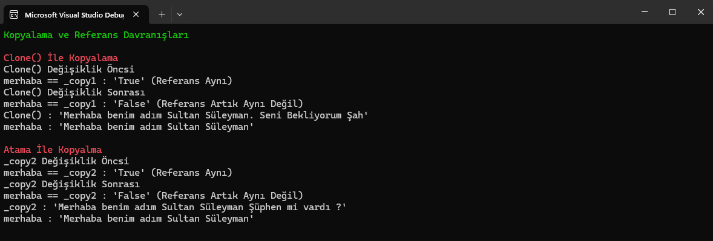
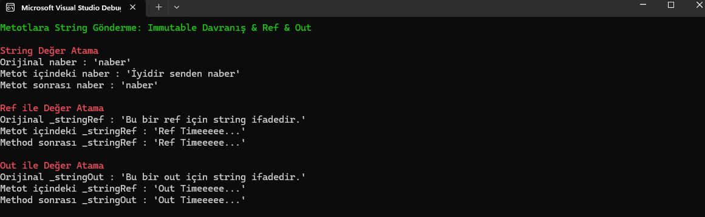
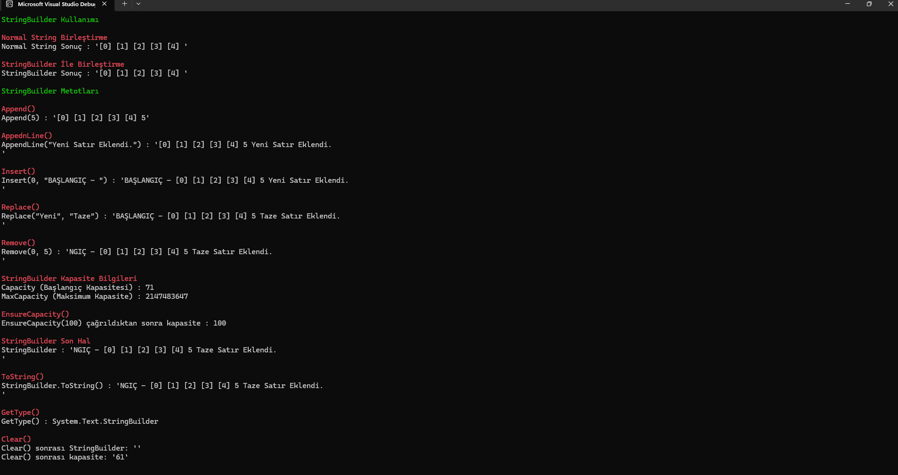
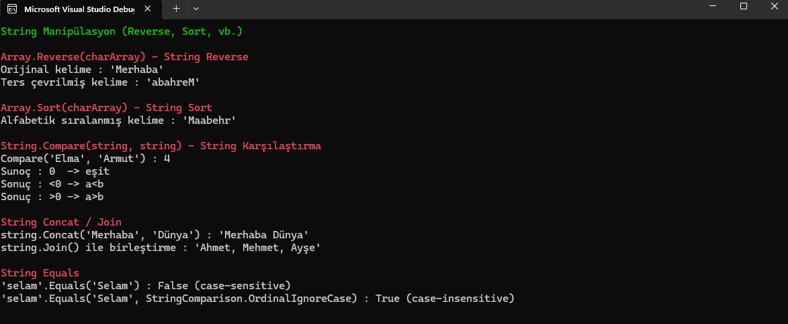

# String

## Proje Hakkında

Bu dizin, **C# dilinde string** veri tipiyle ilgili temel ve ileri düzey işlemleri örnekleyen bağımsız konsol projelerini içerir.

Her alt proje, string türüyle yapılabilecek farklı işlemleri (oluşturma, kopyalama, karşılaştırma, vs.) uygulamalı olarak göstermektedir.

## Solution Yapısı

```
SolutionRoot/
│
|_ Utils/                  <- Class Library (DLL)
│   |_ Printer.cs           <- Ortak print metodları (Red, Green)
│
|_ CreateString/       <- Console App (String oluşturma/birleştirme)
|_ StringMethods/      <- Console App (String metotları)
|_ CopyString/         <- Console App (Kopyalama işlemleri)
|_ StringImmutable/    <- Console App (Immutable davranış)
|_ StringBuilder/      <- Console App (StringBuilder kullanımı)
|_ CharArray/          <- Console App (Char dizileri)
|_ Manipulation/       <- Console App (Karakter sıralama ve karşılaştırma)
```
* String ile ilgili konular için ayrı console projeleri oluşturulmuştur.
* `Utils` Class Library, tüm projeler tarafından referans alınır ve ortak fonksşyon içerir.

## Proje Konuları

### **I.** String Oluşturma ve Birleştirme
---

- `string` değişken tanımlama
- `+` Operatörü ile string birleştirme
- `String.Format()` kullanımı
- String Interpolation (`$""`) kullanımı 

> Kullanım olarak Interpolation (`$""`) tercih edilir.


### **II.** String Methodları
---

| Metot                            | Açıklama                                                |
| -------------------------------- | ------------------------------------------------------- |
| `Length`                         | String uzunluğunu döndürür                              |
| `StartsWith()`                     | Başlangıç kontrolü (case-sensitive / insensitive)       |
| `EndsWith()`                       | Bitiş kontrolü                                          |
| `IndexOf()` / `LastIndexOf()`        | Karakter / kelime konumu                                |
| `Insert()`                         | String içine ekleme yapar                               |
| `Substring()`                      | Belirli aralıktaki karakterleri döndürür                |
| `ToUpper()` / `ToLower()`            | Büyük / küçük harf dönüştürme                           |
| `Replace()`                        | Belirli karakter veya kelimeyi değiştirme               |
| `Remove()`                         | Belirli aralıktaki karakterleri siler                   |
| `Contains()`                       | Karakter veya kelimeyi içerip içermediğini kontrol eder |
| `Split()` / `Join()`                 | String ayırma ve birleştirme                            |
| `Trim()` / `TrimStart()` / `TrimEnd()` | Başındaki ve sonundaki boşlukları temizleme             |



### **III.** String Kopyalama
---

- `Clone()` ile kopyalama
- Atama ile kopyalama
- Kopyalama işleminde `Immutable` davranış analizi
- `Object.ReferenceEquals()` ile referans kontrolü

> string referans tipidir ama immutable olduğu için kopyalama her zaman beklenen şekilde referans paylaşımı yaratmaz.



### **IV.** Methoda String Parametre Verilmesi
---

- Normel bir şekilde parametre verilmesi
- `ref` ile parametre verilmesi
- `out` ile parametre verilmesi
- Referans ve Immutable davranış analizi

> `ref` veya `out` kullanıldığında string’in immutable yapısı değişmez; ama değişkenin referansının yeniden yönlendirilmesine izin verilir.



### **V.** `StringBuilder` Kullanımı
---

- `StringBuilder` ile mutable string oluşturma
- Performan avantajları ve kapasite yönetimi
- StringBuilder Methodları

| Metot          | Açıklama                                  |
| -------------- | ----------------------------------------- |
| `Append()`     | String sonuna ekleme yapar                |
| `AppendLine()` | Sonuna satır ekler                        |
| `Insert()`     | Belirli index'e ekleme yapar              |
| `Replace()`    | Belirli karakter veya kelimeyi değiştirir |
| `Remove()`     | Belirli karakterleri siler                |
| `Clear()`      | Tüm içeriği temizler                      |



### **VI.** String ve Char Dizileri
---

- `String` -> `char[]` dönüşümü (`ToCharArray`)
- `char[]` -> `String` dönüşümü (`new string(charArray)`)
- Karakter dizisi üzerinde değişiklikler ve immutable açıklamalar

> string immutable olduğu için `kelime[0] = 'X'` gibi bir işlem hata verir.
Değişiklik için önce `char[]`’e çevrilmesi gerekir.


### **VII.** String Manipülasyon
---

- Reverse ve Sort işlemleri
- Karşılaştırma ve Birleştirme
- `case-sensitive` ve `case-insensitive` karşılaştırmalar

| İşlem         | Açıklama                                       |
| ------------- | ---------------------------------------------- |
| `Array.Reverse()`       | String ters çevirilir                          |
| `Array.Sort()`          | Karakterler alfabetik sıraya dizilir           |
| `String.Compare()`       | İki string karşılaştırılır                     |
| `string.Concat / string.Join()`  | String birleştirme işlemi                      |
| `string.Equals()`        | Eşitlik kontrolü, case-sensitive / insensitive |



## Eklenecekler

```
Localization / Globalization (Yerelleştirme)
	- CultureInfo,
	- NumberFormatInfo 
	- DateTimeFormatInfo
```

## Faydalı Kaynaklar

- [Microsoft Docs (EN) - String](https://learn.microsoft.com/en-us/dotnet/api/system.string?view=net-9.0)
- [Microsoft Docs (TR) - String](https://learn.microsoft.com/tr-tr/dotnet/csharp/programming-guide/strings/)
- [Microsoft Docs (TR) - String](https://learn.microsoft.com/tr-tr/dotnet/fundamentals/runtime-libraries/system-string)
- [Microsoft Docs (TR) - CultureInfo](https://learn.microsoft.com/tr-tr/dotnet/api/system.globalization.cultureinfo?view=net-8.0)
- [GeeksforGeeks - String](http://geeksforgeeks.org/c-sharp/string-in-c-sharp/)
- [Youtube - Soner Gül](https://www.youtube.com/watch?v=ZitZj998dtA)